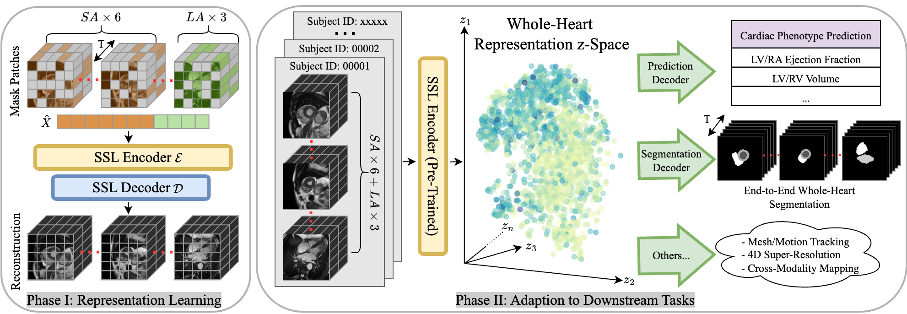

# Whole Heart 3D+T Representation Learning Through Sparse 2D Cardiac MR Images
Yundi Zhang, Chen Chen, Suprosanna Shit, Sophie Starck, Daniel Rueckert, and Jiazhen Pan

This repository contains the code used in the research paper: [Whole Heart 3D+T Representation Learning Through Sparse 2D Cardiac MR Images](https://arxiv.org/pdf/2406.00329), accepted by MICCAI 2024. For more details, please refer to the paper.

## Description
In this project, we introduce a novel **self-supervised learning** framework for generating comprehensive **3D+T representations of the whole heart** using sparse 2D cardiac MRI sequences. Key features include:
- Utilizes masked imaging modeling to uncover correlations between spatial and temporal patches across cardiac MRI stacks
- Learns meaningful heart representations without requiring labeled data
- Demonstrates robustness and consistency even when some MRI planes are missing
- Trained on 14,000 unlabeled cardiac MRI scans from UK Biobank and evaluated on 1,000 annotated scans for downstream tasks
- Outperforms baselines on tasks requiring comprehensive 3D+T cardiac information:
    - Cardiac phenotype prediction (e.g. ejection fraction, ventricle volume)
    - Multi-plane/multi-frame cardiac MRI segmentation

The learned representations can be directly applied to various downstream cardiac analysis tasks. The method's ability to handle incomplete inputs and integrate spatiotemporal information from sparse MRI planes makes it promising for practical clinical applications.

We demonstrate the potential for developing more efficient and robust cardiac MRI analysis pipelines using self-supervised representation learning approaches.

## Table of Contents
- [Installation](#installation)
- [Data File Structure](#data-file-structure)
- [Usage](#usage)
- [License](#license)
- [Contact](#contact)

## Installation

To get a local copy up and running, follow these steps:

#### Prerequisites
Before you begin, ensure you have met the following requirements:
- **Python 3.9+** as the programming language.
- **Conda** installed (part of the Anaconda or Miniconda distribution).
- **pip** installed for package management.
- **Git** installed to clone the repository.

#### Steps

1. **Clone the repository**
    ```bash
    git clone https://github.com/Yundi-Zhang/WholeHeartRL.git
    cd WholeHeartRL
    ```

2. **Create and activate a Conda environment**
    ```bash
    # Create a new Conda environment with Python 3.9 (or your required version)
    conda create --name wholeheart python=3.9

    # Activate the Conda environment
    conda activate wholeheart
    ```

3. **Install dependencies**
    ```bash
    pip install torch==2.0.1+cu117 torchvision==0.15.2+cu117 torchsummary -f https://download.pytorch.org/whl/torch_stable.html
    pip install -r requirements.txt
    ```

4. **Configure environment variables**
    Rename `.env.name` to `.env` and update the necessary environment variables.
    ```bash
    mv .env.name .env
    ```

## Data File Structure
This project uses NIfTI files to store imaging data. For each subject, the data is organized in a specific folder structure with various NIfTI files for different types of images and their corresponding segmentations.

#### File Organization

For each subject, the data is contained in a single folder. The folder includes:

- **Short-axis (SAX) Images:**
  - `sa.nii.gz`: The short-axis images.
  - `seg_sa.nii.gz`: The segmentation maps for the short-axis images.

- **Long-axis (LAX) Images:**
  - `la_2ch.nii.gz`: The long-axis images in the 2-chamber view.
  - `la_3ch.nii.gz`: The long-axis images in the 3-chamber view.
  - `la_4ch.nii.gz`: The long-axis images in the 4-chamber view.

#### Example Directory Structure

Here is an example of how the data should be organized for one subject:
```bash
data/
│
└── subject1/
    ├── sa.nii.gz
    ├── seg_sa.nii.gz
    ├── la_2ch.nii.gz
    ├── la_3ch.nii.gz
    └── la_4ch.nii.gz
```
#### Processed image data
This project uses `.npz` files to store processed image data. Each `.npz` file contains a dictionary with specific keys, where each key corresponds to a NumPy array. The arrays have the shape `(H, W, S, T)` where  S is the number of slices in the volume. Each `.npz` file contains the following keys:

- **`sax`**: Short-axis images.
- **`lax`**: Long-axis images.
- **`seg_sax`**: Segmentation maps for short-axis images.
- **`seg_lax`**: Segmentation maps for long-axis images.

#### Example Structure fo preprocessed data

The `.npz` file contains a dictionary like this:

```python
{
  "sax": np.array of shape (H, W, S, T),
  "lax": np.array of shape (H, W, S, T),
  "seg_sax": np.array of shape (H, W, S, T),
  "seg_lax": np.array of shape (H, W, S, T)
}
```


## Usage
This project supports three tasks: **Pertaining**, **Segmentation**, and **Regression**. Follow the instructions below to run the application for each task:

1. **Pertaining**: Follow the specific instructions provided for the Pertaining task.

2. **Segmentation**: To run the Segmentation task, make sure to specify the pretraining checkpoint path by setting the `general.ckpt_path` parameter.

3. **Regression**: For the Regression task, you also need to provide the pretraining checkpoint path using the `general.ckpt_path` parameter.

#### Pertaining via reconstruction
```bash
source .env
python3 main.py train \
-c ./configs/config_reconstruction.yaml \
-g your_wandb_group_name \
-n your_wandb_job_name
```
#### Segmentation
```bash
source .env
python3 main.py train \
-c ./configs/config_segmentation.yaml \
-g your_wandb_group_name \
-n your_wandb_job_name
```
#### Regression
```bash
source .env
python3 main.py train \
-c ./configs/config_regression.yaml \
-g your_wandb_group_name \
-n your_wandb_job_name
```

## License
This project is licensed under the MIT License - see the [LICENSE](LICENSE) file for details.

## Contact
For questions or suggestions, contact [yundi.zhang@tum.de](mailto:yundi.zhang@tum.de) or [jiazhen.pan@tum.de](mailto:jiazhen.pan@tum.de). If you use this code in your research, please cite the above mentioned paper.
